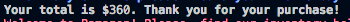

BAMAZON Project

Description : Bamazon is a mysql database project where it updates it's data based on the user's input.

Below are examples of BAMAZON's functionality.

This is the table view  

The user is looking for the ID and clicked "1"  

This is the total for their item choice  

This is the stock quantity before it updated  

After updated  

